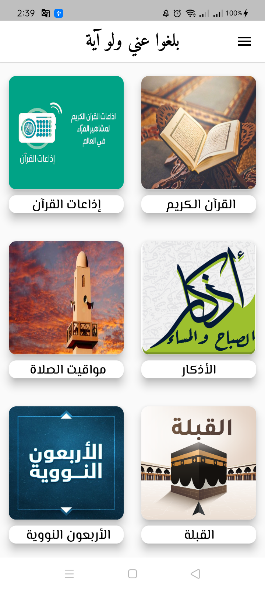
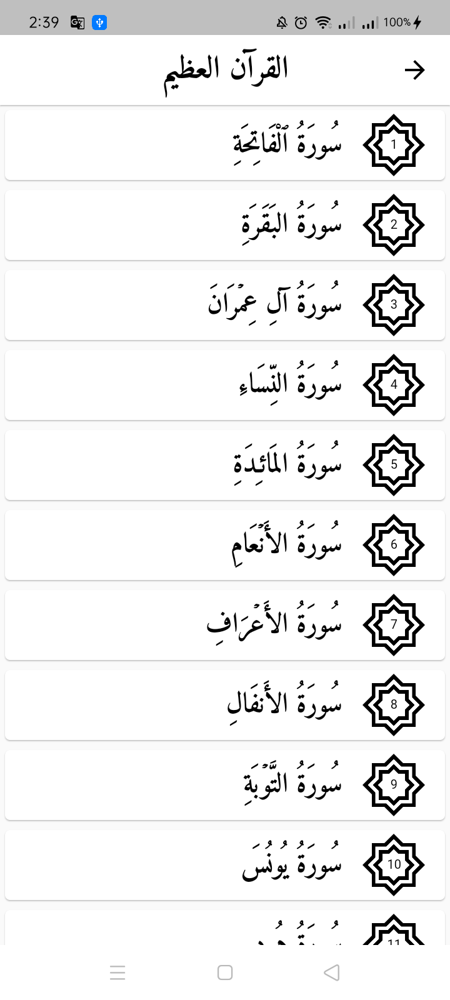
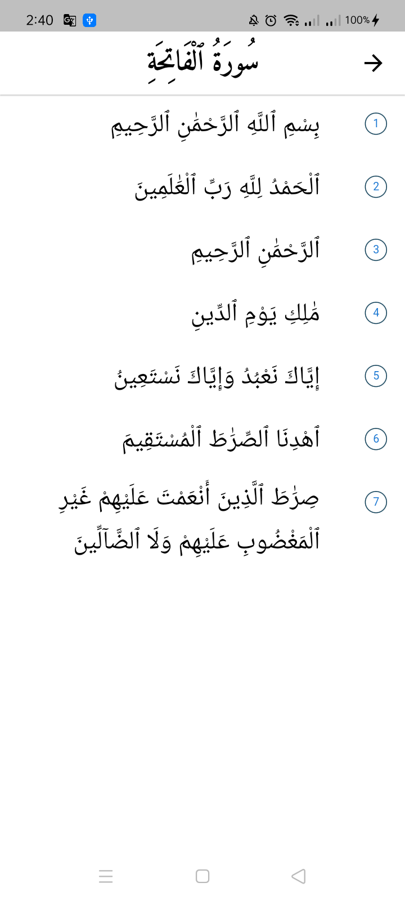
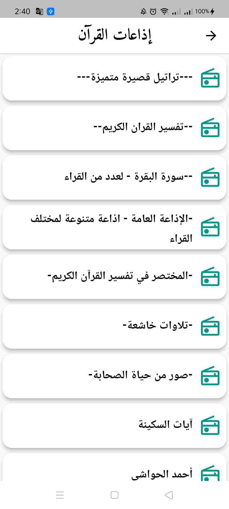
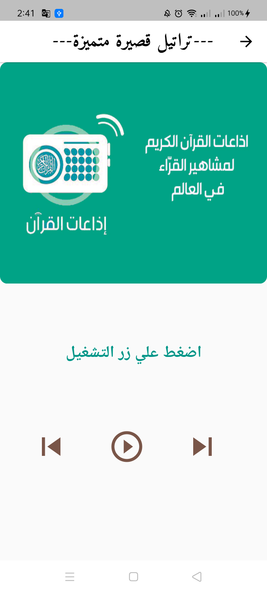
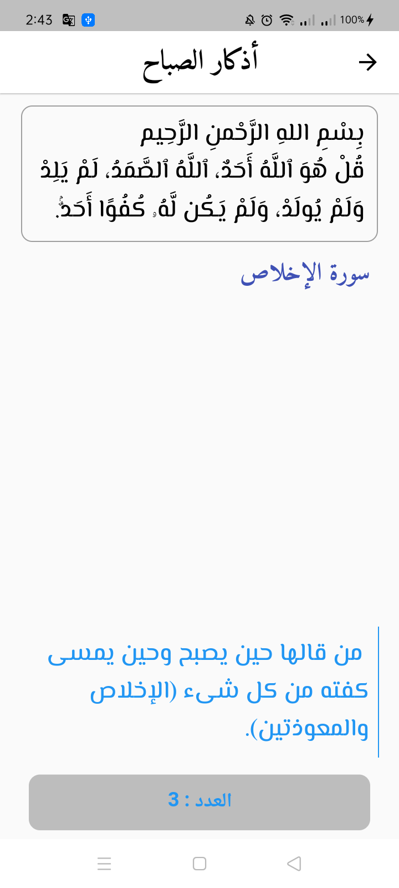
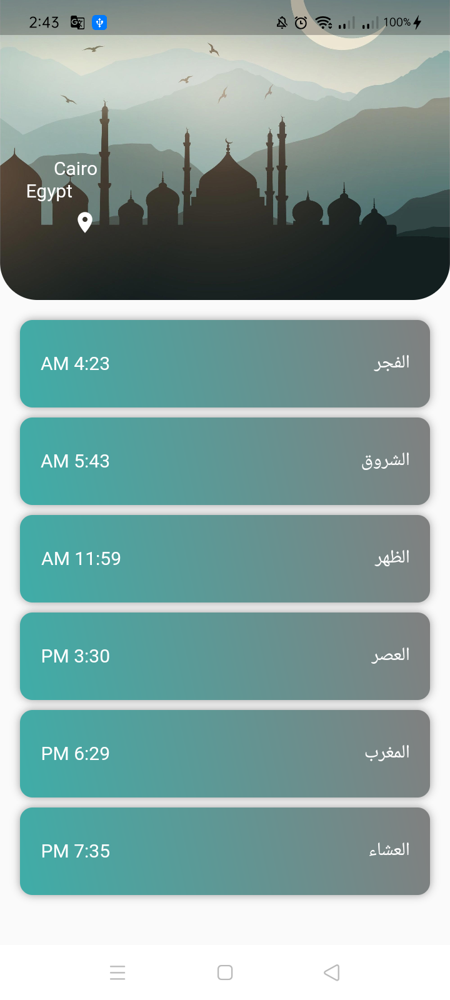
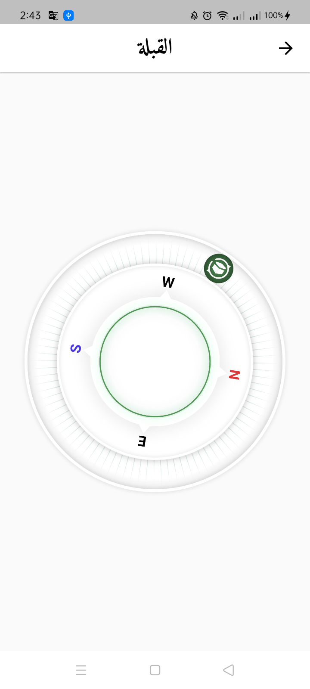
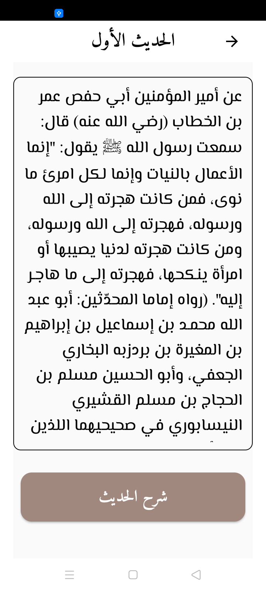
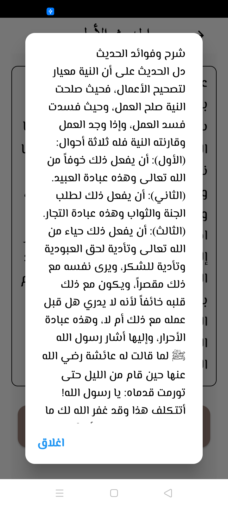

<div align="center">


	

# تطبيق بلغوا عني ولو آية
	
[](https://github.com/Muhammed-Ayad/Balgho-Convey-App/main)	
[](https://play.google.com/store/apps/details?id=com.convey.ayah.mohamed.ayad)


يحتوي التطبيق علي القرآن الكريم واذاعات القران واذكار الصباح والمساء وبعض الادعية الذي يحتاجها المسلم في حياته وايضا مواقيت الصلاة واتجاه القبلة وكتاب الاربعون النووية
The application contains the Noble Qur’an, Qur’an radio stations, morning and evening remembrances, and some supplications that a Muslim needs in his life, as well as prayer times, the direction of the qiblah, and the Forty-Nawawi book
	
[](https://play.google.com/store/apps/details?id=com.convey.ayah.mohamed.ayad)


```
قال رسول الله صلى الله عليه وسلم

بَلِّغُوا عَنِّي ولو آيَةً، وَحَدِّثُوا عن بَنِي إِسْرَائِيلَ وَلَا حَرَجَ، وَمَن كَذَبَ عَلَيَّ مُتَعَمِّدًا، فَلْيَتَبَوَّأْ مَقْعَدَهُ مِنَ النَّارِ.

الراوي : عبدالله بن عمرو | المحدث : البخاري | المصدر : صحيح البخاري
الصفحة أو الرقم: 3461 | خلاصة حكم المحدث : [صحيح] |
```














<div align="left">

# Apis 

## Quran
### http://api.alquran.cloud/v1/quran/quran-uthmani

## Radios
### https://www.mp3quran.net/api/radio/radio_ar.json

## Azkar
### https://github.com/osamayy/azkar-db/blob/master/azkar.json

## Nawawi
### https://github.com/osamayy/40-hadith-nawawi-db/blob/main/40-hadith-nawawi.json

## Azan
### https://api.pray.zone/v2/times/today.json?city=cairo&fbclid=IwAR1y4oO4O-S50WUZfshra9ZCzPk8OWMtdEnByg8ieX-TwX6qs3IazGbRTtY%27


# Package

## audioplayers :   A Flutter plugin to play multiple simultaneously audio files, works for Android, iOS, macOS and web.

## carousel_slider :A carousel slider widget.

## equatable : Simplify Equality Comparisons

## flutter_bloc  : Widgets that make it easy to integrate blocs and cubits into Flutter. Built to work with package:bloc.

## flutter_compass :A Flutter compass. The heading varies from 0-360, 0 being north.

## flutter_localizations : How to track the device’s locale (the user’s preferred language).

## google_fonts : The google_fonts package for Flutter allows you to easily use any of the thousands of fonts available from fonts.google.com in your Flutter app.

## http : A composable, Future-based library for making HTTP requests.

## intl : Provides internationalization and localization facilities, including message translation, plurals and genders, date/number formatting and parsing, and bidirectional text.

## loading_animation_widget : 

## share_plus : A Flutter plugin to share content from your Flutter app via the platform's share dialog.

